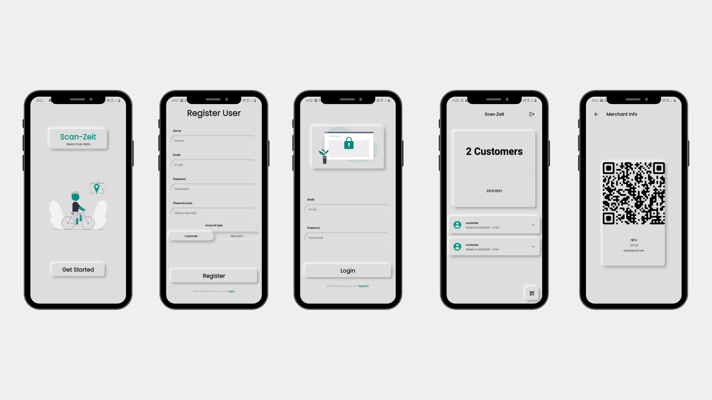

# Scan Zeit
Scan Zeit is a mobile application where shopkeepers have an app that shows QR code and users can scan this QR code which will automatically add that user to the visitor list. This should replace manual entry of contact details in the shop due to COVID.

## Team members
1. [Rijfas](https://github.com/rijfas/)
2. [Faiz](https://github.com/FaizArifUP)
3. [Asif](https://github.com/asif-max) 

## Team Id
BFH/recCGIcGRrv3SHBS7/2021

## Link to product walkthrough
[link to video](https://youtu.be/C1TgnNWNFN4)

## How it Works ?
[link to video](https://youtu.be/C1TgnNWNFN4)

## Libraries used
---
  ### Firebase
  cloud_firestore: ^2.2.0
  firebase_auth: ^1.2.0
  firebase_core: ^1.2.0

  ### State management
  flutter_bloc: ^7.0.0

  ### UI
  cupertino_icons: ^1.0.2
  rflutter_alert: ^2.0.2
  flutter_neumorphic: ^3.0.3
  flutter_spinkit: "^4.1.2"
  flutter_svg: ^0.22.0
  flutter_swiper: ^1.1.6
  auto_size_text: ^2.1.0

  ### QR Management
  pretty_qr_code: ^2.0.1
  qr_code_scanner: ^0.4.0

  ### Miscellaneous
  url_launcher: ^6.0.4

## How to configure
1. [Download](https://github.com/rijfas/scan-zeit/releases/tag/0.0.1) the realase package 
2. Install on android (Avoid playprotect warning if any)
## How to Run
1. [link to video](https://youtu.be/C1TgnNWNFN4)
